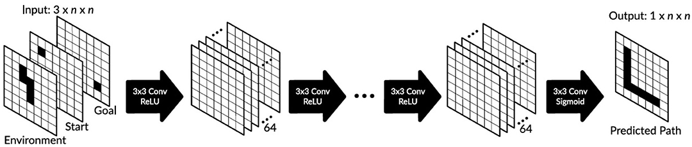
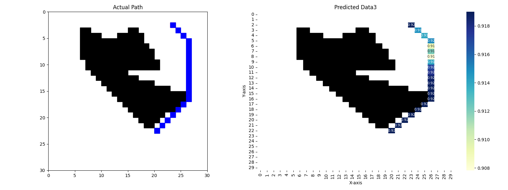
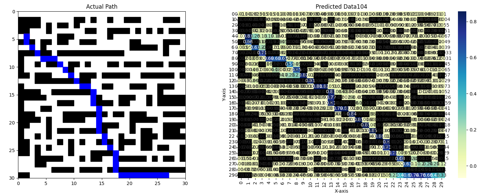
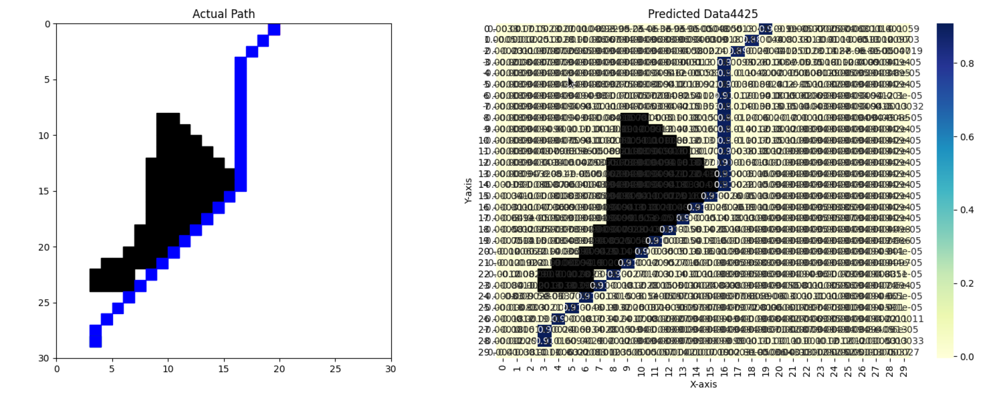
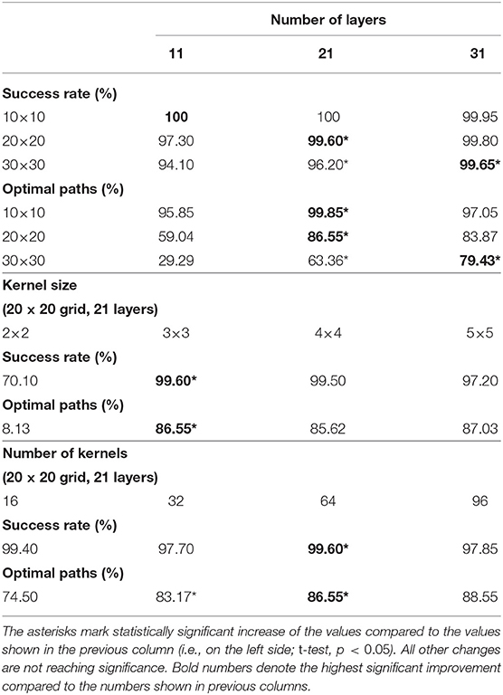
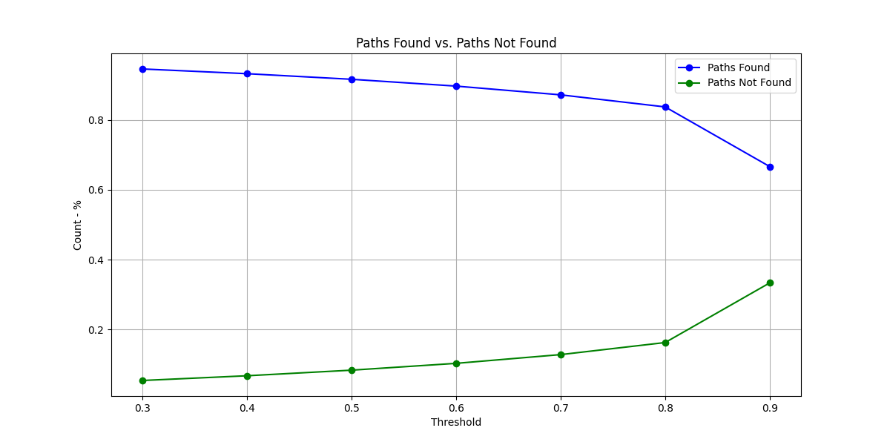
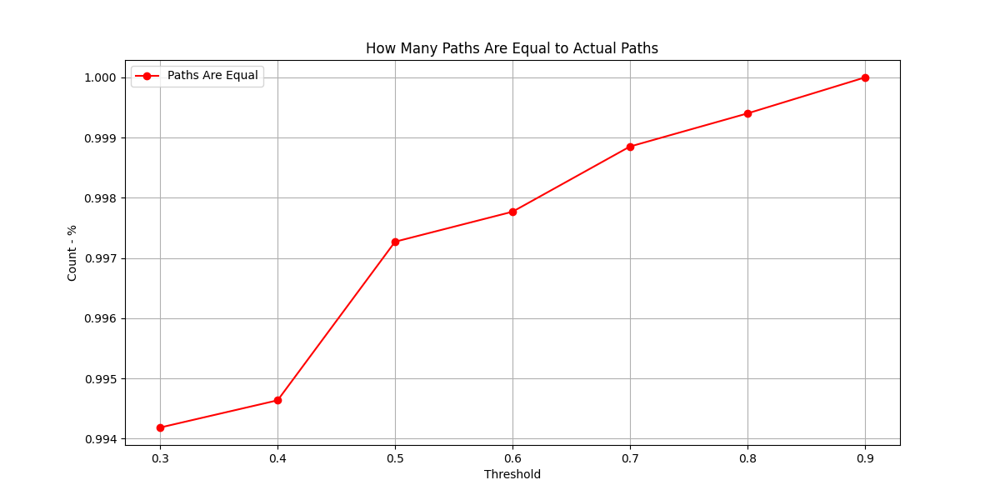
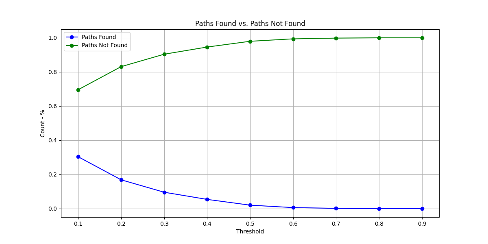

## One-Shot Multi-Path Planning Using Fully Convolutional Networks

download 100*100
[link](https://jumbomail.me/j/80usSkOiPk2MDXb)

- This repository contains the implementation and codebase inspired by the research article "One-Shot Multi-Path Planning Using Fully Convolutional Networks in a Comparison to Other Algorithms" published in Frontiers in Neurorobotics.
Overview

 - The objective of this repository is to provide a comprehensive guide and implementation for one-shot multi-path planning using fully convolutional networks (FCNs).
 - This repository replicates and extends the methodologies discussed in the research paper to facilitate further development and research in this field.
 - [link](https://www.frontiersin.org/journals/neurorobotics/articles/10.3389/fnbot.2020.600984/full)

### Network inputs - 3 N*N matrixes:
  - s_maps matrix - indicates the start point.
  - g_maps matrix - indicates the endpoint.
  - input matrix - indicates the positions of the obstacles. (1 = obstacle, 0 - free location)
    
### Network output - 1 N*N matrix:
 - outputs matrix - indicates where the path should pass.
 - the output is a matrix of probabilities from -1 to 1.
 

## Neural Network Architecture - `train_2d.py`

1. **First Convolutional Layer**
   - Filters: 64
   - Kernel Size: 3x3
   - Strides: 1x1
   - Padding: "same"
   - Activation: 'relu'
   - Batch Normalization

2. **Intermediate Convolutional Layers** (repeated `HIDDEN_LAYERS` times)
   - Filters: 64
   - Kernel Size: 3x3
   - Strides: 1x1
   - Padding: "same"
   - Activation: 'relu'
   - Batch Normalization

3. **Final Convolutional Layer**
   - Filters: 1
   - Kernel Size: 3x3
   - Strides: 1x1
   - Padding: "same"
   - Activation: 'sigmoid'
   - Batch Normalization
   - Dropout: 10%

4. **Model Compilation**
   - Optimizer: 'adam'
   - Loss: 'mse'
   - Metrics: ['accuracy']

5. Implement the paper code using the new version of Keras and TensorFlow.
  - TensorFlow version: 2.16.2
  - Keras version: 3.1.1
  - NVIDIA driver version: 555.42.02
  - CUDA Version: 12.5

## Evaluate the result - `compare_result.py`

#### Path Checking Functionality

- **`is_path_present(start, goal, thresholded_pred)`**
  - Uses BFS with diagonal movements to check for a path between a start and goal point on a grid.
  - Returns the length of the path if found, or -1 if no path exists.

#### Visualization and Analysis Functions

- **`plot_row_th(example_num, row, actual_output, predicted_output)`**
  - Plots a 30x30 grid map with actual and optionally predicted paths using matplotlib and seaborn. 
  - Calculates and prints the predicted path length compared to the actual path length.

#### Data Analysis and Visualization

- **`count_paths(df)`**: Counts paths found and not found based on the results stored in a DataFrame.
- **`compare_paths(found_paths)`**: Compares predicted path lengths to actual path lengths and counts paths that are less than, equal to, or longer than actual paths.
- **`plot_path_status(count_not_found, count_found, N_tries)`**: Plots bar charts showing the number of paths found vs. not found.
- **`plot_comparison(count_less, count_equal, count_longer, count_found)`**: Plots bar charts comparing predicted path lengths to actual path lengths.
- **`print_summary_statistics(count_not_found, count_found, count_equal, count_longer, N_tries)`**: Prints summary statistics including percentages of paths found vs. not found, and paths shorter, equal, or longer than actual paths.

#### Main Execution and Threshold Variation

- The script iterates over multiple threshold values to evaluate model performance.
- For each threshold, it predicts paths for a number of trials, stores the results, and computes analysis metrics using the functions above.
- Results are stored in a DataFrame  and visualized using matplotlib to show how different thresholds affect path prediction accuracy.

## Research Conclusions:

- Try different types of Loss Functions - MSE, Accuracy, Binary_Accuracy - Accuracy gets the best result so far. [link](https://keras.io/api/losses/)
- Generate new data set to train the model - Not a maze-like environment, a "real-life" environment - 1-3 obstacles the path should pass.
- Paper data set:

- Our data set:

- World size and hidden-Layer:
  - The hidden layer amount depends on the world size.
  - The paper mentions that and recommends 31 Hidden layers for 30*30.
  - Use larger hidden layer (50) **not** shown better results.

  
- Training set size - a huge different after training on **100K** data set.
- 
## Performance:
- 1 Epoch running time, 60K example:
  - Using **CPU** 11th Gen Intel(R) Core(TM) i7-11800H @ 2.30G - **12:00** minutes.
  - Using local **GPU** NVIDIA Quadro T1200 4GB - **1:50** minutes.
  - Using a remote machine with **GPU** NVIDIA A100 Tensor Core 80GB - **0:17** minutes.

## Test and Result:

- example how 50 layers effect the results:

